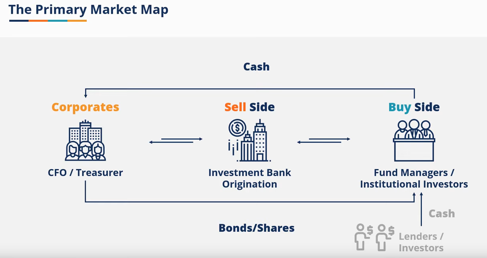
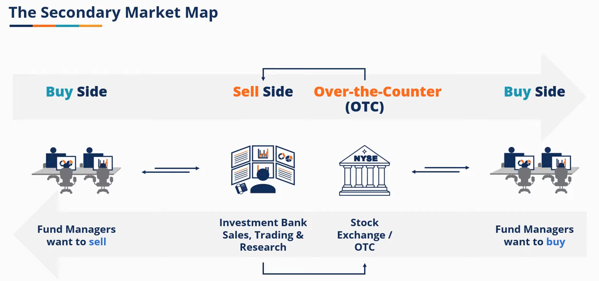
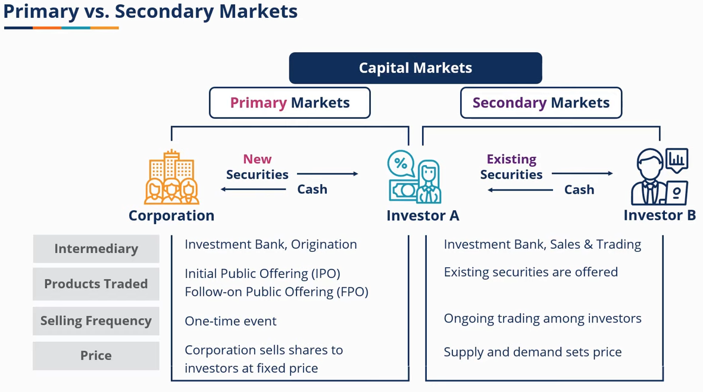
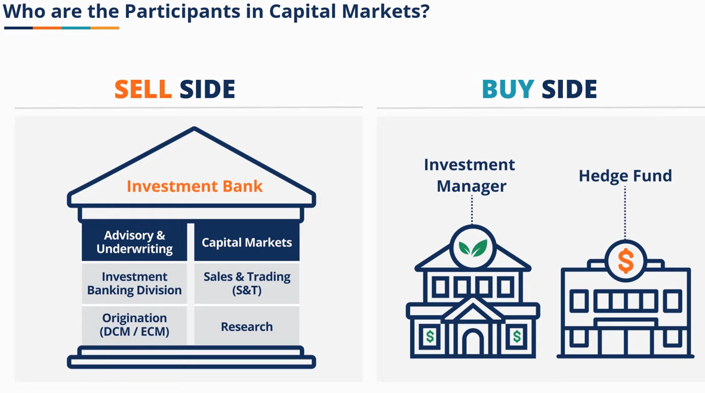
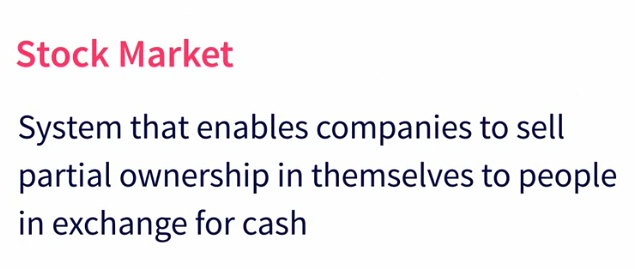
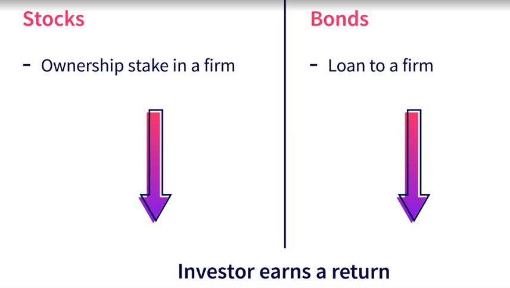
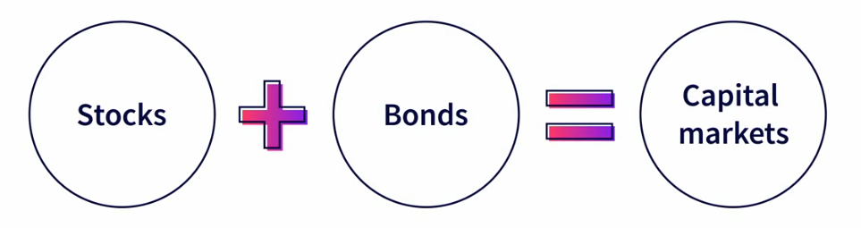
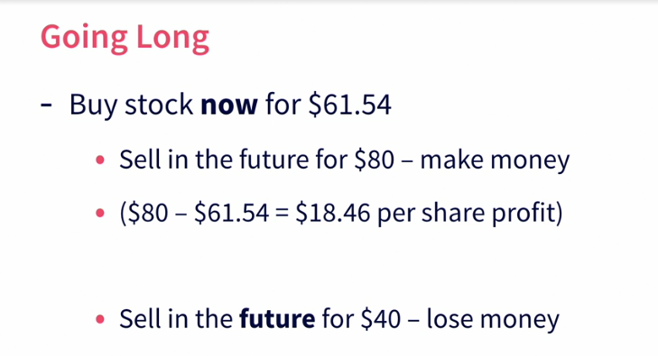
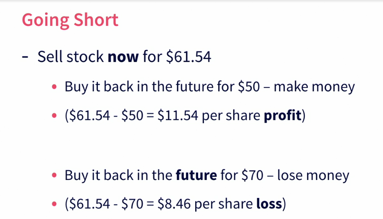

# Capital Market 

## primary market

## secondary market

## primary market vs secondary market

## Stock market

# Key Takeaways from the Video "What are stocks?"

- **Ownership**: Stocks represent partial ownership in a company. When you buy a share, you become a shareholder with ownership rights proportional to your shares.

- **Returns**: Stocks have historically provided the highest rate of return compared to other investment options, making them crucial for long-term savings and retirement.

- **Dividends and Voting Rights**: Shareholders may receive dividends and have the right to vote on important company matters, such as electing the board of directors.

# Investing in Stocks

- **Purpose of the Stock Market**: The stock market connects investors with companies needing to raise money, driving the economy by facilitating investment and growth.

- **Investment Returns**: Investors buy stocks to gain an ownership stake in companies and earn a share of the profits, known as returns. Historically, stock returns have averaged around 11% since 1928, though they can fluctuate significantly.

- **Investment Strategy**: It's important to set a comfortable allocation of stocks and stick to it, even during market downturns, to avoid panic-driven decisions.

# Difference Between Stocks and Bonds

- **Ownership vs. Debt**: Stocks represent ownership in a company, whereas bonds are loans made to a company or government that must be repaid with interest.

- **Returns**: Stocks typically offer higher potential returns through capital gains and dividends, while bonds provide fixed interest payments and are considered safer but with lower returns.

- **Risk**: Stocks are generally more volatile and carry a higher risk of loss, while bonds are typically seen as safer investments, although they can still carry risks, such as interest rate and credit risk.

- **Voting Rights**: Stockholders often have voting rights in company matters, while bondholders do not have such rights.

# The Bid-Ask Spread

- **Bid-Ask Spread**: This is the difference between the price a buyer is willing to pay for a stock (bid) and the price a seller is asking for (ask). For example, in the video, Tesla's bid price is $204.30, and the ask price is $204.42.

- **Market Orders**: These orders are executed at the current market price. When you place a market order, you agree to buy or sell at the best available price.

- **Limit Orders**: These orders specify the price at which you are willing to buy or sell. For instance, you might place a limit order to buy Tesla stock at $200, and the order will only be executed if the stock price falls to that level.

# Shorting and Going Long

- **Going Long**: Buying shares of a stock with the expectation that its price will rise. If the stock price increases, you make a profit; if it decreases, you incur a loss.

- **Shorting a Stock**: Selling shares you do not own at the current price with the expectation that the price will fall. You later buy the shares at a lower price to deliver them, making a profit if the price drops. If the price rises, you incur a loss.

- **Financial Implications**:
    - When going long, your potential loss is limited to the amount you invested.
    - When shorting, your potential loss is theoretically unlimited since the stock price can keep rising.
